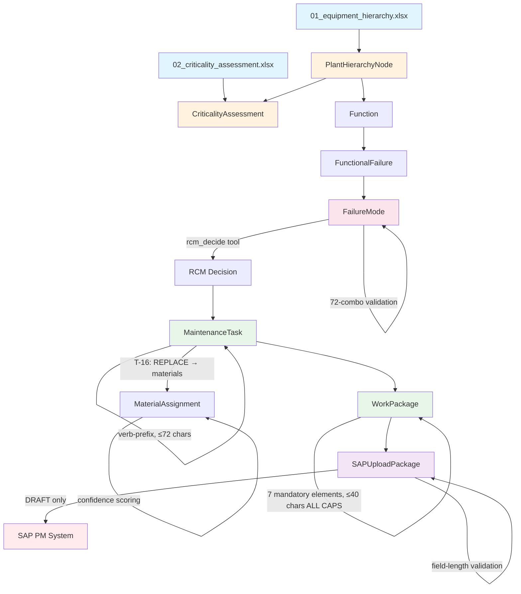
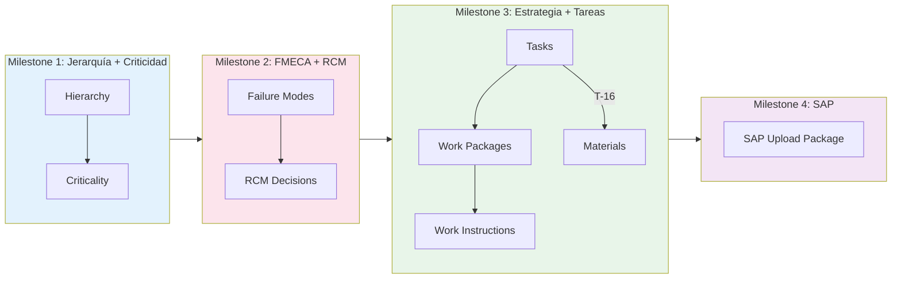

# AMS — Índice de Entregables

> Catálogo exhaustivo de los entregables del sistema Asset Management Software (AMS),
> organizado por milestone y área de gestión.

---

## Resumen Ejecutivo

El sistema AMS opera con **4 agentes especializados** que colaboran a lo largo de **4 milestones** con aprobación humana obligatoria en cada compuerta:

| Agente | Modelo | Milestones | Skills |
|--------|--------|------------|--------|
| Orchestrator | Sonnet | Todos (coordinación) | 16 |
| Reliability | Opus | M1, M2, M3 | 15 |
| Planning | Sonnet | M3, M4 | 12 |
| Spare Parts | Haiku | M3 | 3 |

### Conteo de Entregables

| Categoría | Cantidad |
|-----------|----------|
| Templates de carga (datos de entrada) | 14 |
| Templates SAP (salida M4) | 3 |
| Template RFI (pre-engagement) | 1 |
| Entregables de salida por milestone | ~25 |
| Entregables cross-cutting | 5 |
| Scoring strategies (QualityScoreEngine) | 6 |

### Conteo por Área × Milestone

| Milestone | Confiabilidad | Planificación | Repuestos | Orquestación |
|-----------|:------------:|:-------------:|:---------:|:------------:|
| M1 | 2 templates, 2 salidas | — | — | Quality Report |
| M2 | 1 template, 4 salidas | — | — | Quality Report |
| M3 | 3 templates (input) | 6 templates, 8 salidas | 1 template, 1 salida | Quality Report |
| M4 | — | 3 SAP templates, 2 salidas | — | Final Report |

---

## Matriz Milestone × Área de Gestión

| | Confiabilidad | Planificación | Repuestos | Orquestación |
|---|---|---|---|---|
| **M1** | Hierarchy, Criticality | — | — | Quality Report M1 |
| **M2** | FMECA, RCM Decisions, FM Register, RBI | — | — | Quality Report M2 |
| **M3** | Weibull, Pareto, Jackknife, RCA | Tasks, WP, WI, Schedule, Priority, KPIs | Materials, BOM | Quality Report M3 |
| **M4** | — | SAP Upload Package (DRAFT) | — | Validation Report, Final Report |

---

## Milestone 1: Descomposición Jerárquica + Criticidad

**Agente responsable:** Reliability (Opus)
**Skills mandatorios:** `build-equipment-hierarchy`, `assess-criticality`
**Skills opcionales:** `resolve-equipment`

### Templates de Entrada

| # | Template | Formato | Agente Consumer | Criterios de Calidad |
|---|----------|---------|-----------------|---------------------|
| 01 | `01_equipment_hierarchy.xlsx` | .xlsx | Reliability | ISO 14224, 6 niveles (PLANT→MAINTAINABLE_ITEM), parent-child válido, `name_fr` obligatorio |
| 02 | `02_criticality_assessment.xlsx` | .xlsx | Reliability | 11 categorías R8 o 6 factores GFSN, `probability` 1-5, `risk_class` requerido |

### Entregables de Salida

| Entregable | Formato | Agente Owner | Criterios de Aceptación |
|------------|---------|-------------|------------------------|
| Hierarchy Validation Report | .md | Orchestrator | Todos los nodos validados, naming convention enforced, nivel-tipo consistente |
| Criticality Summary | .md | Orchestrator | AA/A+ flagged para revisión, distribución de riesgo por clase (I-IV) |
| Quality Score Report (M1) | .json | Orchestrator | ≥85% pass threshold (AMS), todas las dimensiones ≥50% |
| PlantHierarchyNode entities | JSON (session state) | Reliability | `NodeType` ↔ `level` validated (PLANT=1, AREA=2, SYSTEM=3, EQUIPMENT=4, SUB_ASSEMBLY=5, MAINTAINABLE_ITEM=6) |
| CriticalityAssessment entities | JSON (session state) | Reliability | `assessed_at`, `assessed_by`, `risk_class` presentes; sin categorías duplicadas |

### Data Entities (schemas.py)

| Entity | Campos Clave | Validaciones |
|--------|-------------|-------------|
| `PlantHierarchyNode` | `node_id`, `node_type`, `name`, `name_fr`, `code`, `level`, `parent_node_id` | Nivel-tipo match, PLANT sin parent, otros con parent |
| `CriticalityAssessment` | `node_id`, `method`, `criteria_scores[]`, `probability`, `risk_class` | ≥1 criteria score, sin categorías duplicadas |

### Scoring (QualityScoreEngine)

| Scorer | Tech Accuracy | Completeness | Consistency | Format | Actionability | Traceability |
|--------|:------------:|:------------:|:-----------:|:------:|:------------:|:------------:|
| HierarchyScorer | 30% | 25% | 15% | 10% | **5%** | **15%** |
| CriticalityScorer | 30% | 25% | 15% | 10% | 10% | 10% |

> **Nota:** Pesos con override de `quality_score_config.yaml` → hierarchy tiene `traceability: 0.15` y `actionability: 0.05`.

---

## Milestone 2: Análisis FMECA + Decisiones RCM

**Agente responsable:** Reliability (Opus)
**Skills mandatorios:** `perform-fmeca` (includes integrated RCM decision tree in Stage 4), `validate-failure-modes`
**Skills opcionales:** `assess-risk-based-inspection` (solo equipos estáticos)

### Templates de Entrada

| # | Template | Formato | Agente Consumer | Criterios de Calidad |
|---|----------|---------|-----------------|---------------------|
| 03 | `03_failure_modes.xlsx` | .xlsx | Reliability | 72-combo FM Table (18 mecanismos × causas), mechanism+cause validados contra `VALID_FM_COMBINATIONS` |

### Entregables de Salida

| Entregable | Formato | Agente Owner | Criterios de Aceptación |
|------------|---------|-------------|------------------------|
| FMECA Analysis Report | .md | Reliability | 100% equipos AA/A cubiertos, RPN calculado (S×O×D) |
| RCM Decision Tree Output | .xlsx | Reliability | 16-path deterministic logic vía `rcm_decide` tool, sin decisiones manuales |
| Failure Modes Register | .xlsx | Reliability | Zero ad-hoc descriptions, cada FM validado contra 72-combo table |
| RBI Analysis | .xlsx | Reliability | **Opcional** — solo para equipos estáticos (recipientes a presión, piping, intercambiadores) |
| Quality Score Report (M2) | .json | Orchestrator | ≥85% pass threshold |
| FailureMode entities | JSON (session state) | Reliability | `mechanism` + `cause` ∈ 72 combos, `is_hidden` ↔ `HIDDEN_*` consequence |

### Data Entities (schemas.py)

| Entity | Campos Clave | Validaciones |
|--------|-------------|-------------|
| `Function` | `node_id`, `function_type` (PRIMARY/SECONDARY/PROTECTIVE), `description` | — |
| `FunctionalFailure` | `function_id`, `failure_type` (TOTAL/PARTIAL) | — |
| `FailureMode` | `functional_failure_id`, `mechanism`, `cause`, `failure_consequence`, `strategy_type` | 72-combo validation, hidden↔consequence match, `what` starts uppercase |
| `FailureEffect` | `evidence`, `safety_threat`, `production_impact`, `estimated_downtime_hours` | — |

### Scoring

| Scorer | Tech Accuracy | Completeness | Consistency | Format | Actionability | Traceability |
|--------|:------------:|:------------:|:-----------:|:------:|:------------:|:------------:|
| FMECAScorer | **35%** | **20%** | 15% | 10% | 10% | 10% |

> **Override:** `fmeca.technical_accuracy: 0.35`, `fmeca.completeness: 0.20` (mayor peso en precisión técnica por complejidad del análisis).

---

## Milestone 3: Estrategia + Tareas + Recursos

**Agentes responsables:** Planning (Sonnet) + Spare Parts (Haiku) + Reliability (Opus, soporte)
**Skills mandatorios Planning:** `prepare-work-packages` (includes integrated WI generation), `group-backlog`, `calculate-priority`
**Skills mandatorios Spare Parts:** `suggest-materials`, `resolve-equipment`
**Skills opcionales:** `schedule-weekly-program`, `orchestrate-shutdown`, `calculate-planning-kpis`, `calculate-life-cycle-cost`, `optimize-cost-risk`, `fit-weibull-distribution`, `analyze-pareto`, `analyze-jackknife`, `perform-rca`

### Templates de Entrada

| # | Template | Formato | Agente Consumer | Uso |
|---|----------|---------|-----------------|-----|
| 04 | `04_maintenance_tasks.xlsx` | .xlsx | Planning | Definición de tareas de mantenimiento |
| 05 | `05_work_packages.xlsx` | .xlsx | Planning | Agrupación en paquetes de trabajo |
| 06 | `06_work_order_history.xlsx` | .xlsx | Reliability (input) | Historial de órdenes para análisis de fiabilidad |
| 07 | `07_spare_parts_inventory.xlsx` | .xlsx | Spare Parts | Inventario de repuestos y BOM |
| 08 | `08_shutdown_calendar.xlsx` | .xlsx | Planning | Calendario de paradas programadas |
| 09 | `09_workforce.xlsx` | .xlsx | Planning | Disponibilidad de mano de obra por especialidad |
| 10 | `10_field_capture.xlsx` | .xlsx | Reliability | Capturas de campo (voz, texto, imagen) |
| 11 | `11_rca_events.xlsx` | .xlsx | Reliability | Eventos para Root Cause Analysis |
| 12 | `12_planning_kpi_input.xlsx` | .xlsx | Planning | Input para 11 KPIs de planificación |
| 13 | `13_de_kpi_input.xlsx` | .xlsx | Reliability | Input para KPIs de eliminación de defectos |
| 14 | `14_maintenance_strategy.xlsx` | .xlsx | Planning | Estrategia de mantenimiento consolidada |

### Entregables de Salida

| Entregable | Formato | Agente Owner | Criterios de Aceptación |
|------------|---------|-------------|------------------------|
| Maintenance Tasks | .xlsx / JSON | Planning | Verb-prefix obligatorio (INSPECT/CHECK/TEST/REPLACE/OVERHAUL/REBUILD/MONITOR/ANALYZE), ≤72 chars, T-16 rule |
| Work Packages | .xlsx / JSON | Planning | 7 elementos mandatorios, nombre ≤40 chars ALL CAPS, constraint ONLINE/OFFLINE |
| Work Instructions | .md / .docx | Planning | LOTOTO, PPE, JRA, safety isolation procedures |
| Material Assignments | .xlsx / JSON | Spare Parts | Confidence ≥0.60 (< flag for review), T-16 compliance, BOM/Catalog/Generic sourcing |
| Priority Scoring | .xlsx | Planning | P1-P5 classification (EMERGENCY→PLANNED) |
| Weekly Schedule | .xlsx | Planning | **Opcional** — resource-balanced, conflict detection |
| Shutdown Plan | .xlsx | Planning | **Opcional** — sequence-optimized, critical path |
| Life Cycle Cost | .xlsx | Planning | **Opcional** — NPV analysis, cost-risk optimization |
| Planning KPIs | .xlsx | Planning | **Opcional** — 11 indicators: schedule compliance, backlog age, reactive ratio |
| Weibull Analysis | .md / .xlsx | Reliability | **Opcional** — β parameter (β<1=infant, β≈1=random, β>1=wear-out), ≥5 failures |
| Pareto Analysis | .md / .xlsx | Reliability | **Opcional** — vital few identification |
| Jackknife Analysis | .md / .xlsx | Reliability | **Opcional** — MTBF vs MTTR zone classification |
| RCA Report | .md | Reliability | **Opcional** — 5W+2H / Ishikawa methodology |
| Quality Score Report (M3) | .json | Orchestrator | ≥85% pass threshold |

### Data Entities (schemas.py)

| Entity | Campos Clave | Validaciones |
|--------|-------------|-------------|
| `MaintenanceTask` | `name` (≤72), `task_type`, `constraint`, `frequency_value/unit`, `labour_resources[]`, `material_resources[]` | Online→access_time=0, Offline→access_time>0 (T-17), status=DRAFT |
| `WorkPackage` | `name` (≤40, ALL CAPS), `constraint`, `allocated_tasks[]`, `labour_summary`, `material_summary` | Operation numbers multiples de 10, status=DRAFT |
| `MaterialResource` | `material_code`, `description`, `quantity`, `unit_of_measure` | — |
| `LabourResource` | `specialty`, `quantity`, `hours_per_person` | ≥1 quantity, >0 hours |

### Regla T-16 (Spare Parts)

| Task Type | Material Requerido | Acción si Incumple |
|-----------|:-----------------:|-------------------|
| REPLACE / OVERHAUL / REBUILD | **Sí** | Flag como incompleto, solicitar a Spare Parts Agent |
| INSPECT / CHECK / TEST | **No** | Flag anomalía si tiene materiales asignados |

### Niveles de Confianza (Material Suggestion)

| Nivel | Confianza | Fuente | Acción |
|-------|:---------:|--------|--------|
| BOM Match | 0.95 | BOM del equipo específico | Autónomo |
| Catalog Default | 0.70 | Component library general | Consultor valida |
| Generic Fallback | 0.40 | Heurísticas por tipo de componente | **REQUIERE VERIFICACIÓN HUMANA** |

### Scoring

| Scorer | Tech Accuracy | Completeness | Consistency | Format | Actionability | Traceability |
|--------|:------------:|:------------:|:-----------:|:------:|:------------:|:------------:|
| TaskScorer | 30% | 25% | 15% | 10% | 10% | 10% |
| WorkPackageScorer | 30% | 25% | 15% | 10% | 10% | 10% |

---

## Milestone 4: Paquete de Carga SAP

**Agente responsable:** Planning (Sonnet)
**Skill mandatorio:** `export-to-sap`

### Templates SAP (Salida)

| Template | Formato | Agente | Contenido |
|----------|---------|--------|-----------|
| `Maintenance Item.xlsx` | .xlsx | Planning | Items de mantenimiento SAP (tipo PM03, func_loc, work_center, planner_group) |
| `Task List.xlsx` | .xlsx | Planning | Listas de tareas SAP (func_loc, system_condition, operations[]) |
| `Work Plan.xlsx` | .xlsx | Planning | Planes de mantenimiento SAP (cycle_value/unit, call_horizon, scheduling_period) |

### Entregables de Salida

| Entregable | Formato | Agente Owner | Criterios de Aceptación |
|------------|---------|-------------|------------------------|
| SAP Upload Package (DRAFT) | .xlsx | Planning | Cross-refs válidos (items↔task lists↔plans), field lengths OK, status=GENERATED |
| Validation Report | .md | Orchestrator | `SAP_SHORT_TEXT_MAX=72`, `SAP_FUNC_LOC_MAX=40`, `SAP_TASK_LIST_DESC_MAX=40` |
| Quality Score Report (M4) | .json | Orchestrator | ≥85% pass threshold |

### Constantes SAP

| Constante | Valor | Aplicación |
|-----------|:-----:|-----------|
| `SAP_SHORT_TEXT_MAX` | 72 | Texto corto de operaciones y tareas |
| `SAP_FUNC_LOC_MAX` | 40 | Functional location identifier |
| `SAP_TASK_LIST_DESC_MAX` | 40 | Descripción de task lists y work packages |

### Data Entities (schemas.py)

| Entity | Campos Clave | Validaciones |
|--------|-------------|-------------|
| `SAPUploadPackage` | `plant_code`, `maintenance_plan`, `maintenance_items[]`, `task_lists[]` | status=GENERATED (DRAFT) |
| `SAPMaintenanceItem` | `item_ref`, `description`, `func_loc`, `task_list_ref`, `priority` | — |
| `SAPTaskList` | `list_ref`, `description`, `func_loc`, `system_condition`, `operations[]` | `system_condition`: 1=Running, 3=Stopped |
| `SAPOperation` | `operation_number`, `short_text` (≤72), `duration_hours`, `num_workers` | op_number múltiplo de 10 |
| `SAPMaintenancePlan` | `plan_id`, `cycle_value/unit`, `call_horizon_pct`, `scheduling_period/unit` | — |

### Scoring

| Scorer | Tech Accuracy | Completeness | Consistency | Format | Actionability | Traceability |
|--------|:------------:|:------------:|:-----------:|:------:|:------------:|:------------:|
| SAPScorer | **20%** | **20%** | 15% | **20%** | 10% | **15%** |

> **Override:** SAP tiene mayor peso en Format (0.20) y menor en Tech Accuracy (0.20) porque el cumplimiento de formato SAP es crítico para la carga exitosa.

---

## Entregables Cross-Cutting

| Entregable | Formato | Owner | Descripción | Milestone |
|------------|---------|-------|-------------|-----------|
| RFI Questionnaire | .xlsx | Orchestrator | Cuestionario pre-engagement de 8 hojas (`00_rfi_questionnaire.xlsx`) | Pre-workflow |
| Required Documentation | .xlsx | Orchestrator | Listado de documentación requerida (`01_required_documentation.xlsx`) | Pre-workflow |
| `project.yaml` | .yaml | Orchestrator | Configuración de proyecto generada desde RFI (`scripts/process_ams_rfi.py`) | Pre-workflow |
| Session Quality Report | .json | Orchestrator | Reporte agregado de calidad across milestones (`SessionQualityReport`) | Todos |
| Client Memory | .md | Workflow | Desviaciones, patrones, notas de reunión (`agents/_shared/memory.py`) | Todos |
| Execution Plan | .yaml | Workflow | Tracking de progreso por stage/item (`agents/orchestration/execution_plan.py`) | Todos |

### RFI Processing Pipeline

```
00_rfi_questionnaire.xlsx
  → scripts/process_ams_rfi.py
    → project.yaml
    → 1-output/rfi/data-availability-report.md
    → 1-output/rfi/scope-assessment.md
    → 1-output/rfi/rfi-followup.md (si hay items pendientes)
    → 3-memory/*/requirements.md (memory seeding)
```

### Quality Score Framework

- **7 dimensiones**: Technical Accuracy, Completeness, Consistency, Format, Actionability, Traceability, Intent Alignment
- **Modo 6-dim** (sin intent profile): Intent Alignment=0%, Tech Accuracy→30%, Completeness→25%
- **Modo 7-dim** (con intent profile): Intent Alignment=15%, redistribución proporcional
- **Thresholds**: PASS ≥85% (AMS), WARNING ≥70%, CRITICAL ≥50%
- **Grades**: A≥91%, B≥80%, C≥70%, D≥50%, F<50%
- **Auto-fail**: Cualquier dimensión <50% → FAIL automático

---

## Apéndice A: Template Cross-Reference

| # | Template | Milestone | Agente Consumer | Downstream Consumer |
|---|----------|:---------:|-----------------|-------------------|
| 01 | `01_equipment_hierarchy.xlsx` | M1 | Reliability | FMECA (M2), SAP func_loc (M4) |
| 02 | `02_criticality_assessment.xlsx` | M1 | Reliability | FMECA priorización (M2), Priority scoring (M3) |
| 03 | `03_failure_modes.xlsx` | M2 | Reliability | Tasks (M3), RCM → strategy_type (M3) |
| 04 | `04_maintenance_tasks.xlsx` | M3 | Planning | Work Packages (M3), SAP operations (M4) |
| 05 | `05_work_packages.xlsx` | M3 | Planning | SAP items (M4) |
| 06 | `06_work_order_history.xlsx` | M3 | Reliability | Weibull, Pareto, Jackknife (M3) |
| 07 | `07_spare_parts_inventory.xlsx` | M3 | Spare Parts | Material Assignments (M3), SAP BOM (M4) |
| 08 | `08_shutdown_calendar.xlsx` | M3 | Planning | Shutdown Plan (M3), Schedule (M3) |
| 09 | `09_workforce.xlsx` | M3 | Planning | Weekly Schedule (M3), Labour Summary |
| 10 | `10_field_capture.xlsx` | M3 | Reliability | Work Requests, condition data |
| 11 | `11_rca_events.xlsx` | M3 | Reliability | RCA Report (M3), CAPA actions |
| 12 | `12_planning_kpi_input.xlsx` | M3 | Planning | Planning KPIs (M3) |
| 13 | `13_de_kpi_input.xlsx` | M3 | Reliability | DE KPIs (M3) |
| 14 | `14_maintenance_strategy.xlsx` | M3 | Planning | Strategy consolidation, SAP upload (M4) |
| SAP-1 | `Maintenance Item.xlsx` | M4 | Planning | SAP PM upload |
| SAP-2 | `Task List.xlsx` | M4 | Planning | SAP PM upload |
| SAP-3 | `Work Plan.xlsx` | M4 | Planning | SAP PM upload |
| RFI | `00_rfi_questionnaire.xlsx` | Pre | Orchestrator | `project.yaml`, scope assessment, memory seeding |

**Total: 14 templates de carga + 3 SAP + 1 RFI = 18 templates**

---

## Apéndice B: Data Entity Lifecycle



### Flujo de Datos por Milestone



---

## Apéndice C: Reglas de Validación por Milestone

### M1: Jerarquía + Criticidad

| Regla | Descripción | Fuente |
|-------|-------------|--------|
| H-01 | ISO 14224 taxonomy, 6 niveles exactos | `build-equipment-hierarchy` skill |
| H-02 | Parent-child integrity (PLANT sin parent, resto con parent) | `PlantHierarchyNode` validator |
| H-03 | `NodeType` ↔ `level` match (PLANT=1...MAINTAINABLE_ITEM=6) | `PlantHierarchyNode.validate_level_type` |
| H-04 | `name_fr` obligatorio (OCP = Marruecos, empresa francófona) | `PlantHierarchyNode` schema |
| H-05 | Functional location naming convention enforced | SAP integration rules |
| C-01 | ≥1 criteria score, sin categorías duplicadas | `CriticalityAssessment.validate_criteria_count` |
| C-02 | `probability` entre 1 y 5 | `CriticalityAssessment` schema |
| C-03 | `risk_class` requerido (I_LOW...IV_CRITICAL) | `CriticalityAssessment` schema |
| C-04 | `assessed_at` y `assessed_by` presentes | `CriticalityAssessment` schema |

### M2: FMECA + RCM

| Regla | Descripción | Fuente |
|-------|-------------|--------|
| FM-01 | `what` field starts uppercase | `FailureMode.validate_what_capitalized` |
| FM-02 | Mechanism+Cause ∈ 72 valid combinations (`VALID_FM_COMBINATIONS`) | `FailureMode.validate_mechanism_cause_combination` |
| FM-03 | `is_hidden` ↔ `HIDDEN_*` consequence coherence | `FailureMode.validate_hidden_consequence` |
| FM-04 | Zero ad-hoc descriptions — all FMs from 72-combo table | Reliability CLAUDE.md constraint |
| FM-05 | RPN = Severity × Occurrence × Detection calculado | `perform-fmeca` skill |
| RCM-01 | All decisions via `rcm_decide` tool — no manual decisions | Reliability CLAUDE.md constraint |
| RCM-02 | 16-path deterministic logic (Moubray/Nowlan-Heap) | `perform-fmeca` Stage 4 (integrated RCM decision tree) |
| RCM-03 | 100% AA/A equipment covered in FMECA | Orchestrator quality check |

### M3: Estrategia + Tareas + Recursos

| Regla | Descripción | Fuente |
|-------|-------------|--------|
| T-01 | Task names ≤72 characters | `MaintenanceTask.name` max_length=72 |
| T-02 | Verb-prefix: INSPECT/CHECK/TEST (CBM), REPLACE/OVERHAUL/REBUILD (scheduled), MONITOR/ANALYZE (predictive) | Reliability + Planning CLAUDE.md |
| T-03 | Verb prefix matches RCM decision `strategy_type` | Planning CLAUDE.md constraint |
| T-16 | REPLACE tasks MUST have materials; INSPECT tasks should NOT | Spare Parts CLAUDE.md, `suggest-materials` skill |
| T-17 | Online tasks → `access_time_hours=0`; Offline → `access_time_hours>0` | `MaintenanceTask.validate_constraint_access_time` |
| WP-01 | 7 mandatory elements: Work Permit, LOTO, Material list, Inspection checklist, JRA, Execution procedure, Work order | Planning CLAUDE.md constraint |
| WP-02 | Work package names ≤40 characters | `WorkPackage.name` max_length=40 |
| WP-06 | Work package names ALL CAPS | `WorkPackage.validate_wp_name_caps` |
| WP-03 | SAP operation numbers = multiples of 10 | `AllocatedTask.validate_op_number` |
| WP-04 | Frequency units consistent (calendar OR operational, never mixed) | Reliability CLAUDE.md constraint |
| MAT-01 | All suggestions include confidence score (0.40–0.95) | Spare Parts CLAUDE.md constraint |
| MAT-02 | Confidence <0.60 flagged "REQUIRES HUMAN VERIFICATION" | Spare Parts CLAUDE.md constraint |
| MAT-03 | Equipment resolved to registered tag before BOM lookup | Spare Parts CLAUDE.md constraint |

### M4: Paquete SAP

| Regla | Descripción | Fuente |
|-------|-------------|--------|
| SAP-01 | `short_text` ≤72 chars (`SAP_SHORT_TEXT_MAX`) | `SAPOperation.short_text` max_length, `sap_export_engine.py` |
| SAP-02 | `func_loc` ≤40 chars (`SAP_FUNC_LOC_MAX`) | `sap_export_engine.py` |
| SAP-03 | Task list description ≤40 chars (`SAP_TASK_LIST_DESC_MAX`) | `sap_export_engine.py` |
| SAP-04 | Cross-reference validation: items ↔ task lists ↔ plans | Planning CLAUDE.md, `validate_sap_export` tool |
| SAP-05 | All outputs marked as DRAFT — never auto-submit | Orchestrator CLAUDE.md constraint |
| SAP-06 | `system_condition`: 1=Running (ONLINE), 3=Stopped (OFFLINE) | `sap_export_engine.py` `CONSTRAINT_TO_SAP` |
| SAP-07 | Frequency unit mapping: DAYS→DAY, WEEKS→WK, MONTHS→MON, YEARS→YR, HOURS→H | `sap_export_engine.py` `FREQ_UNIT_TO_SAP` |

### Cross-Cutting

| Regla | Descripción | Fuente |
|-------|-------------|--------|
| QG-01 | Human APPROVE required at every milestone gate | Orchestrator CLAUDE.md |
| QG-02 | Quality score ≥85% (AMS threshold) to pass gate | `quality_score_config.yaml` |
| QG-03 | Any dimension <50% → automatic FAIL | Orchestrator CLAUDE.md |
| QG-04 | All outputs are DRAFT — human decides when final | Orchestrator CLAUDE.md |
| QG-05 | Session state is source of truth (not conversation history) | Orchestrator CLAUDE.md |
| MEM-01 | Client memory overrides methodology defaults | All agent CLAUDE.md files |
| MEM-02 | Intent profile overrides methodology (but memory overrides intent) | All agent CLAUDE.md files |

---

## Apéndice D: Skill-to-Deliverable Mapping

| Skill | Agent | Milestone | Deliverable(s) Produced |
|-------|-------|:---------:|------------------------|
| `build-equipment-hierarchy` | Reliability | M1 | PlantHierarchyNode entities, Hierarchy Validation Report |
| `assess-criticality` | Reliability | M1 | CriticalityAssessment entities, Criticality Summary |
| `perform-fmeca` | Reliability | M2 | FailureMode entities, FMECA Analysis Report, RCM Decision Tree Output (Stage 4) |
| `validate-failure-modes` | Reliability | M2 | FM validation (72-combo check) |
| ~~`run-rcm-decision-tree`~~ | ~~Reliability~~ | ~~M2~~ | ~~DEPRECATED — merged into `perform-fmeca` Stage 4~~ |
| `assess-risk-based-inspection` | Reliability | M2 | RBI Analysis (optional, static equipment) |
| `fit-weibull-distribution` | Reliability | M3 | Weibull Analysis (optional) |
| `analyze-pareto` | Reliability | M3 | Pareto Analysis (optional) |
| `analyze-jackknife` | Reliability | M3 | Jackknife Analysis (optional) |
| `perform-rca` | Reliability | M3 | RCA Report (optional) |
| `model-ram-simulation` | Reliability | M3 | RAM Simulation Report (optional, Monte Carlo) |
| `prepare-work-packages` | Planning | M3 | Work Packages + Work Instructions (integrated Phase 2) |
| ~~`generate-work-instructions`~~ | ~~Planning~~ | ~~M3~~ | ~~DEPRECATED — merged into `prepare-work-packages` Phase 2~~ |
| `group-backlog` | Planning | M3 | Backlog stratification |
| `calculate-priority` | Planning | M3 | Priority Scoring (P1-P5) |
| `schedule-weekly-program` | Planning | M3 | Weekly Schedule (optional) |
| `orchestrate-shutdown` | Planning | M3 | Shutdown Plan (optional) |
| `calculate-planning-kpis` | Planning | M3 | Planning KPIs (optional) |
| `calculate-life-cycle-cost` | Planning | M3 | Life Cycle Cost (optional) |
| `optimize-cost-risk` | Planning | M3 | Cost-risk optimization (optional) |
| `export-to-sap` | Planning | M4 | SAP Upload Package (DRAFT) |
| `suggest-materials` | Spare Parts | M3 | Material Assignments |
| `resolve-equipment` | Spare Parts | M3 | Equipment tag resolution |
| `optimize-spare-parts-inventory` | Spare Parts | M3 | Inventory optimization (optional) |
| `validate-quality` | Orchestrator | All | Quality Score Reports |
| `orchestrate-workflow` | Orchestrator | All | Workflow coordination |
| `generate-reports` | Orchestrator | All | Maintenance reports (optional) |
| `conduct-management-review` | Orchestrator | All | ISO 55002 9.3 review (optional) |
| `calculate-kpis` | Orchestrator/Reliability | All/M3 | MTBF, MTTR, OEE, Availability |
| `calculate-health-score` | Orchestrator | All | Asset health index (optional) |
| `detect-variance` | Orchestrator | All | Cross-plant variance (optional) |
| `benchmark-maintenance-kpis` | Orchestrator | All | SMRP benchmarking (optional) |
| `assess-am-maturity` | Orchestrator | M1 | ISO 55000 maturity assessment (optional) |
| `develop-samp` | Orchestrator | All | Strategic Asset Management Plan (optional) |
| `manage-capa` | Planning/Reliability | M3 | CAPA tracking (optional) |
| `import-data` | Orchestrator | All | Data import (CSV/Excel) |
| `export-data` | Orchestrator | All | Data export |
| `manage-notifications` | Orchestrator | All | Alert management (optional) |
| `manage-change` | Orchestrator | All | Equipment MOC (optional) |
| `analyze-cross-module` | Orchestrator | All | Cross-module correlation (optional) |

---

*Generado automáticamente desde las fuentes del sistema AMS v1.2 — 2026-03-11*
